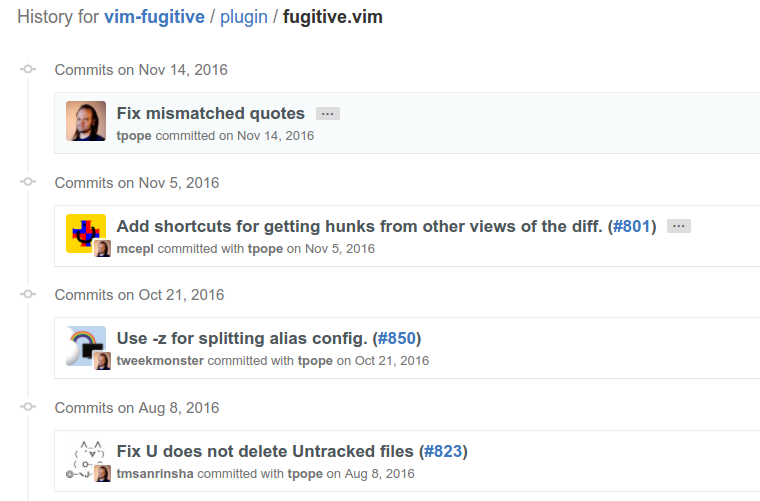

Hi everyone!

This is my first post and to be honest I am still not sure _what_ I want to write about exactly, but I spent some time thinking about the _how_. But before telling you more about this, let me quickly introduce myself:

My name is Asura Enkhbayar and I am a Master's student in Cognitive Science at the University of Vienna. I have been playing with the idea of starting a blog for quite some time, but never. But recently I decided to try out an experiment and proposed blog posts as deliverables for a project at Uni and my supervisor agreed to it. My two main motivations for this were:

+ Trick myself into writing blog posts.
+ After coming back from [OpenCon 2016](opencon2016.org) I was still struggling to find my own way of being more open as a student. So I here I am now, attempting to build my truly *open* blog.

## The fear of blogging

There are many reasons one might not want to blog. A quick [google search](https://www.google.at/search?q=blogging+fear&oq=blogging+fear&aqs=chrome..69i57j69i60l3j69i61j69i60.1849j0j7&sourceid=chrome&ie=UTF-8) will show a myriad of listicles and blogs about the fear of bloggers. The thought of putting my personal ideas on paper (or markdown files in this case) and releasing them into the vastness of the opiniated internet is frightening. It feels like a one-way exposition of my persona to the public (and the mean trolls), whereas I would rather prefer to hear the critique, feedback, suggestions and maybe even some nice words. And that is exactly what I hope to achieve with this blog (with a horribly, uncreative name). 

In the beginning I will mainly use this blog as a tool to communicate thoughts and ideas to my project supervisors and I hope that they will join me in this experiment!

## More than just reading

Making a blog bidirectional sounds quite simple, if the solution consists of simply providing the possibility to comment on the text. But I would like to take the idea a few steps further and enable a more specific and detailed discussion of content.

1. __Feedback__ --- Readers should be able to leave a simple comment with little effort.

2. __Annotations__ --- Readers should be able to highlight interesting parts, take notes and discuss contetnt (features known from most PDF Viewers).

3. __Collaboration__ --- Readers should be able to propose changes and even create content.

<figure class="floatRight">
    
</figure>

### Feedback

Scroll down to the end of the article to see Disqus in action. Beloved Wikipedia tells us:

>[Disqus](https://disqus.com) (pronounced discuss) is a worldwide blog comment hosting service for web sites and online communities that uses a networked platform.

Even though I found quite a lot of criticism ([reddit thread](https://www.reddit.com/r/programming/comments/2c19of/your_users_deserve_better_than_disqus/)), I chose to go for Disqus because of a two very simple and straightforward reasons:

+ It's easy to deploy (not much of a web-dev - still playing around)
+ Users can simply login with the trinity of the internet: Facebook, Google, Twitter

Alternative solutions are very welcome -- just leave a comment (*hihi*)

<figure class="floatRight">
    
</figure>

### Annotations

The heart of the bidirectional blog. [Hypothesis](https://hypothes.is) is a non-profit project that introduces the well-known features from PDF viewers to the internet. In their own words:

>Our mission is to bring a new layer to the web. Use Hypothesis to discuss, collaborate, organize your research, or take personal notes.

Their mission in a few more words (+ great animations):

<iframe src="https://www.youtube.com/embed/QCkm0lL-6lc" frameborder="0" allowfullscreen style="display: block; width: 560px; height: 315px;"></iframe>

**How to use Hypothesis**

I am aware that their webpage is quite secretive concerning the trivial sufferings of a [nOOb](http://www.urbandictionary.com/define.php?term=n00b&defid=284896), but I recommend their [quick start guide](https://hypothesis.zendesk.com/hc/en-us/articles/230742327-Quick-start-guide). If you're too lazy for that (or simply don't want to install another extension for ever-memory-hogging Chrome), you can also simply sign-up [here](https://hypothes.is/signup) and start annotating on this page. Hypothesis is *enabled per default*.

A few final remarks about Hypothesis on this blog:

+ All annotations can be either public or private (or just available to groups)
+ The annatations are backep up on Hypothesis' servers. Which means that the effort will not be lost in case I move this blog to a new domain.
+ I am not sure about the mobile support yet, but I will probably disable Hypothesis on mobile devices.

<figure class="floatRight">
    
</figure>

### Collaboration

Finally, I want to briefly describe how to propose changes and edits on this blog. For the coders and tech-savvy people: GitHub & Pull Requests. Of course I am far from being the first one to use this idea (e.g. [GitBook](https://github.com/GitbookIO/gitbook)).

For the rest of you, who aren't familiar with these two terms, I will now introduce you to the world of *version control software*: 

This whole blog (code, texts, images) lives on [GitHub](https://github.com), which is a platform for developers to maintain and keep track of projects. Similar to the history of changes in Google Docs, *Git* is a piece of software that tracks the changes in files (usually code) while *GitHub* takes it a step further and makes it possible to collaborate with other developers (while keeping track of all changes that each user makes).

Basically this means that every version of this blog, that I wanted to save until now, can be seen here: [https://github.com/Bubblbu/this-and-that](https://github.com/Bubblbu/this-and-that). 

**Well okay... but collaboration?**

Now the final piece to solve this puzzle is called *Pull Requests*. GitHub allows other users to take a copy of any file (even owned by other users) and change it. But if that user wants to actually see his changes in the original file, a so-called *Pull Request* is issued to the owner. The owner can now accept, reject or discuss the proposed changes.

**Well okay... but how?**

+ Propose changes to an article

    1. Click on "Edit this article"
    2. Login into your GitHub account (GitHub acc)
    2. Edit article in the web interface
    3. Submit and propose changes

+ To view the all changes to a document, just click on "View history" and you will be taken to the following view:

<figure class="floatCenter">
    
    <figcaption>Screenshot taken from <a style="color:#5d93ff;" href="https://github.com/tpope/vim-fugitive/commits/master/plugin/fugitive.vim">GitHub</a></figcaption>
</figure>

## So what now?

The only thing that's left to say is quite obvious... 

Don't hesitate to critisize, applaud, highlight, annotate, comment about anything and everything on this blog! Feel free to leave a few words or even submit a Pull Request on GitHub to get involved.