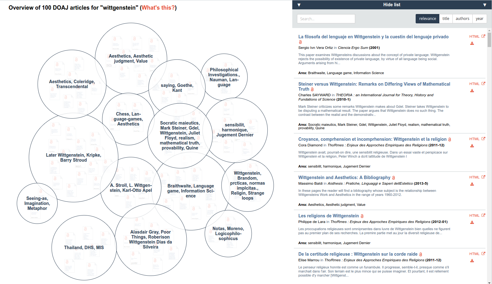
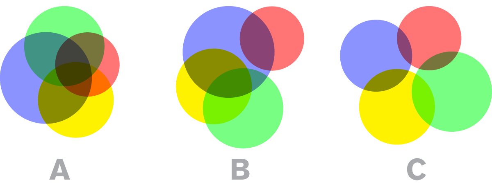

*Is it possible to take the philosophy of Wittgenstein (possibly the most tremendous philosopher of the 20th century. He's great. It's true.) and use his ideas to design and develop software used in everyday life?*

This was one of the first questions, that I asked myself, when I decided to work on Wittgenstein's philosophy during my exchange year in Ljubljana. In this first article about my uni project I will introduce my research ideas, the most relevant Wittgensteinian concepts and the Open Source project [Open Knowledge Maps](https://openknowledgemaps.org) (OKM) as a use case.

## Wittgenstein & Technology

Wittgenstein, as one of the most important philosophers of the 20th century, is subject of a myriad of societies and symposia. Generations of scholars have dedicated their efforts to interpreting and developing Wittgenstein's ideas, very often (more or less) politely agreeing to disagree in their respective standpoints.

Despite recent political events ("fake news", anti-intellectual movement) we are undeniably still living in a scientific-technological era, where societal progress is tightly intertwined with scientific and technological progress. Relatively new academic fields such as Science and Technology Studies (STS) are reflecting the need to understand and investigate the interplay of science, technology and society. Similarly, more and more researchers seem to be interested in the potential interplay of Wittgenstein and technology (in 2009 "Technology" has earned it's entry in the [the Stanford Encyclopedia of Philosophy](https://plato.stanford.edu/entries/technology/)).

While the [International Wittgenstein Symposium](http://www.alws.at/index.php/symposium/) in Kirchberg still sticks to relatively traditional topics, it is interesting to see that other conferences and workshop are exactly addressing the aforementioned relationship with technology. Two examples taking place in Q1 2017 are (1) [Wittgenstein and Applied Epistemology](http://www.britishwittgensteinsociety.org/cfp-wittgenstein-applied-epistemology) and (2) [Wittgenstein and Philosophy of Technology](http://philtech.univie.ac.at/news/events-eg-talks-conferences/news/cfp-workshop-wittgenstein-and-philosophy-of-technology/).

The proposed topics are diverse, ranging from Scientific Epistemology and Social Epistemology to more specific questions such as "*Can a Wittgensteinian approach contribute to addressing the problem of how to communicate specialized disciplinary terminology in transdisciplinary research?*" It is this last question, that resonates with my own project goals:

>Can Wittgensteinian concepts serve as an effective framework to implement a knowledge (scientific literature) discovery and exploration tool used in science communication?

With this blog post I want to clarify basic terminology used in the project, such as "knowledge discovery". The term is used in many different ways; each with their nuanced usage of *knowledge* and *discovery*, depending on the background of the user. Then OKM and their processing pipeline will be introduced. Finally, a few Wittgensteinian concepts will be briefly discussed (a detailed elaboration is reserved for future posts) while OKM will serve as a reference point and constant reality check. 

## Knowledge Discovery Systems

Knowledge discovery is "the nontrivial extraction of implicit, previously unknown, and potentially useful information from data." (Frawley et al, 1992, p.58). In other words knowledge discovery is the process of automatically extracting patterns and information from large volumes of data (often texts) that are useful for an end user. Frawley et al continue to describe a framework in order to cover the wide range of possible knowledge discovery systems. A prototypical discovery system consists of:

1. Discovery algorithm
2. A set if input information
3. Discovered knowledge

(1) The discovery algorithm is the core of every system and has the task to identify relevant patterns in the data and describing them in a meaningful way. Modern discovery systems usually deploy a variety of methods including, but not limited to machine learning, statistical methods and user guidance.

(2) Discovery algorithms can accept a multitude of information as inputs. Most commonly raw data from the database is used, but also additional information from data dictionaries or ontologies are common data sources. *Domain knowledge*, usually provided by a subject matter expert can also prove to be useful in order to restrict the search space, but Frawley et al also emphasize the risk of possibly missing valuable discoveries. Lastly, a *user-biased* evaluation of the discovered knowledge can additionally serve as input to further refine results.

(3) According to Frawley et al the extracted knowledge has three properties. The *form* of discovered knowledge is the description of its nature. Certain patterns can relate to data fields within a single record or relate the fields of different records. Furthermore, they discern between qualitative and quantitative relationships, describing logical and numerical relationships. The *Representation* of knowledge is of utmost importance as the usefulness of the data ultimately depends on the users evaluation. In the case of a human end-user typical representations are natural language, formal logics or especially visual depictions (Tufte 1991). Most discoveries are of probabilistic nature, rather than certain facts, due to a variety of reasons. Input data can be erroneous, methods are often non-deterministic and lastly *uncertainty* is an intrinsic property of the real-world.

## Open Knowledge Maps

As previously mentioned, I would like to investigate the applicability of Wittgenstein-inspired approaches in knowledge discovery by means of evaluating their applicability in a use case. [Open Knowledge Maps](openknowledgemaps.org) is an Open Source knowledge discovery system intended to provide interactive, so-called *knowledge map* of a research field. The following example map for the topic "Wittgenstein" in the Directory of Open Access Journals (DOAJ): [https://bit.ly/okmaps_wittgenstein](http://bit.ly/okmaps_wittgenstein)

*Input data:* OKM takes available meta-data of publications (optionally full-texts can be included) from either [PubMed](https://www.ncbi.nlm.nih.gov/pubmed) or the [DOAJ](https://www.ncbi.nlm.nih.gov/pubmed) as input parameters for further processing. 

*Method:* OKM employs Natural Language Processing and statistical methods to extract groups of similar articles and give them a meaningful label.

*Discovered Knowledge:* The discovered knowledge is then represented on a two-dimensional map, where proximity represents similarity of topic clusters.

<figure class="floatCenter">
    
    <figcaption>Knowledge map for "Wittgenstein" on Open Knowledge Maps</figcaption>
</figure>

The three main processing steps can be summarized as:

1. Clustering of articles into groups of similar items
2. Labeling of groups according to the content
3. Representation -- Determine the layout of the map

## Applying Wittgenstein

Last but not least, let's return to Wittgenstein and have a look at some concepts that offer themselves as potential pillars of a Wittgensteinian knowledge discovery system. The content of this section simply represents an excerpt of the status-quo of my thought process and thus, should be regarded as a taster for future elaborations. Accordingly I want to repeat my appeal from my v,.ery [first blog post](/hello-world/): "Feel free to comment, highlight and annotate!"

**Language-games & family resemblance**

After reading about family resemblances, I inquired about a way to imagine how they would work in real life. Interestingly, a visual explanation was offered to me:

<figure class="floatCenter">
    
    <figcaption>Family resemblance. <a href="http://dyske.com/paper/1016">Source.</a> Retrieved: 03.02.2017</figcaption>
</figure>

Without going into too much details, Wittgenstein's theory says that related concepts often do not share a set of *common features* (Configuration A), but instead are related through overlapping similarities between certain concepts (Configuration C). Using the example of "games" Wittgenstein explains:

>I can think of no better expression to characterize these similarities than "family resemblances"; for the various resemblances between members of a family: build, features, colour of eyes, gait, temperament, etc. etc. overlap and criss-cross in the same way. – And I shall say: "games" form a family. (PI 67)

Apart from the striking similarity between this way of visualizing *family resemblances* and the *knowledge maps* used in OKM, this work will investigate whether the overlapping clusters in OKM actually can be considered family resemblances between research fields.

*Are the clusters actually representing family resemblances of related research field and what are the practical implications of such a view?*

**'Meaning is use'**

>“For a large class of cases of the employment of the word ‘meaning’—though not for all—this word can be explained in this way: the meaning of a word is its use in the language” (PI 43)

In order to understand the meaning of a word, we need to see how the word is actually used in our language. In the case of OKM the question of *meaning* poses itself after the initial processing step (clustering). How should certain groups of publications be named, in order to provide a meaningful *name* for the end user? Currently [tf-idf](https://en.wikipedia.org/wiki/Tf%E2%80%93idf) is employed to determine the importance of certain words in the set of documents, that are then used as a group of labels.

*How could a Wittgensteinian approach to name the clusters look like?*

**Wittgenstein's Aesthetics**

The visual representation of the discovered knowledge, in the form of an interactive, lucid map, is undoubtedly a crucial feature of OKM. 

"Aesthetics is a branch of philosophy dealing with the nature of art, beauty, and taste, with the creation and appreciation of beauty." ([Wikipedia](https://en.wikipedia.org/wiki/Aesthetics)) But does the consideration of appreciation and taste, which most of us would describe as fundamentally subjective, help a knowledge discovery system to improve their service? Apart from Wittgenstein's special stance towards aesthetics (W. regarded aesthetics to be rather interwoven with the rest of philosophy, rather than as a individual branch of philosophy), the following quote, once again, reminded me of the approach that OKM takes in "describing a research topic":

>Aesthetics teaches us essentially to recognize a system. It teaches us to see a system. The fact that in the end its ultimate reasons must “speak” to us, so to speak, does not concern it. (Wittgenstein, 2000, 54r-56v)

Borutti (2013), who considered Wittgenstein's aesthetics and it's implications for the Understanding of Meaning, further elaborates:

>To “possess judgment” means being capable of recognizing meaning in the entire context: for example, having experience in music and a knowledge of its tradition, knowing how to learn it, how to speak about it, who performs it, how it is performed, when an instrument comes in, etc. The cultivation of taste is explained by the cultivation of a common sense of the rules, or a common grammatical sensitivity, that enables one to “give reasons”.

We see that for Wittgenstein "understanding the meaning" definitely has an aesthetic component.

*Can Wittgenstein's considerations of Aesthetics provide a useful framework to operate within for a visual knowledge discover system like Open Knowledge Maps?*

## Conclusion

Wittgenstein is definitely one of the most <strike>tremendous</strike> influential philosophers of the last century. His works are still being re-interpreted and viewed from new perspectives over and over again. With this work I am hoping to finally find an access to the world of philosophy and make a small contribution to the quest of finding the "Applied Wittgenstein".

Why Open Knowledge Maps? The answer is quite simple, as I am a voluntary developer and part of the project. I am curious whether Wittgenstein's concepts can be applied and used in a real-life development setting.

## References

Borutti, S. (2013). Wittgenstein’s Concepts for an Aesthetics: Judgment and Understanding of Form, 1933(1938), 55–66.

Frawley, W. J., Piatetsky-Shapiro, G., & Matheus, C. J. (1992). Knowledge discovery in databases: An overview. *AI magazine*, 13(3), 57.

Tufte, E. R. (1991). Envisioning information. *Optometry & Vision Science*, 68(4), 322-324.

Wittgenstein, L. (2000). *Wittgenstein’s Nachlass*. Bergen Edition Bergen‐Oxford.

Wittgenstein, L. (2010). *Philosophical investigations*. John Wiley & Sons.

