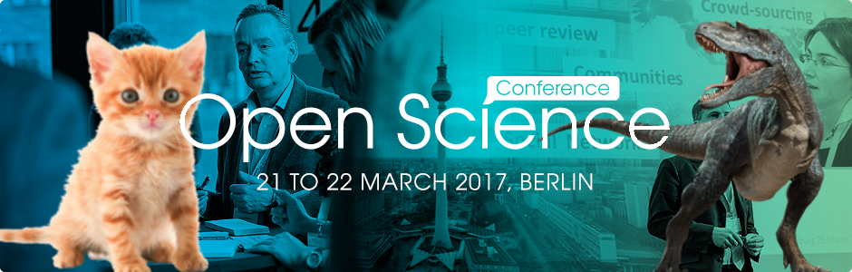
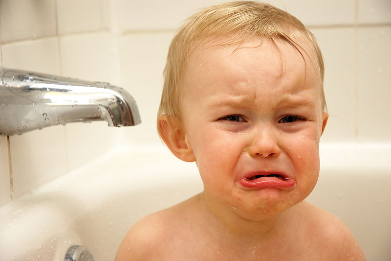
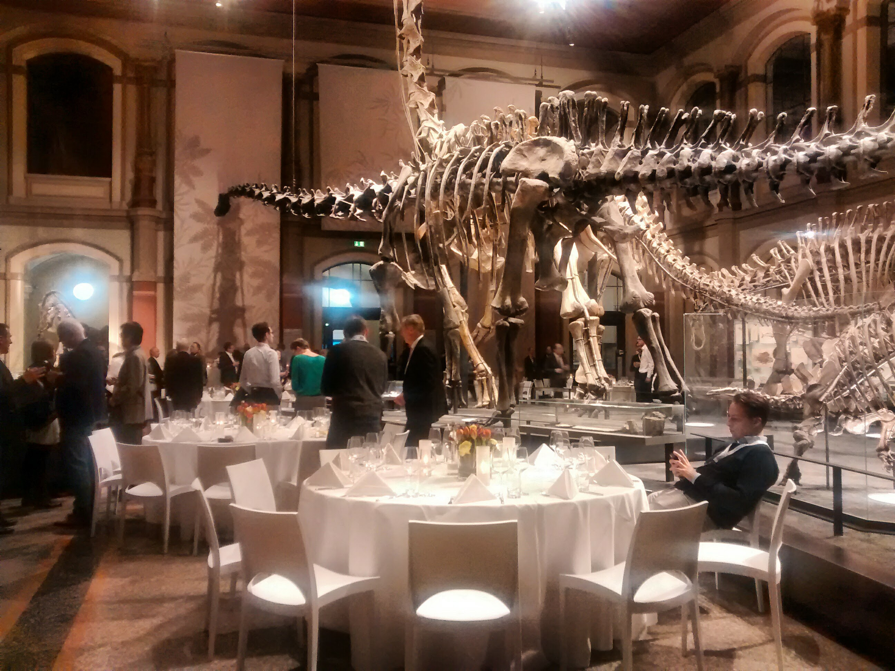
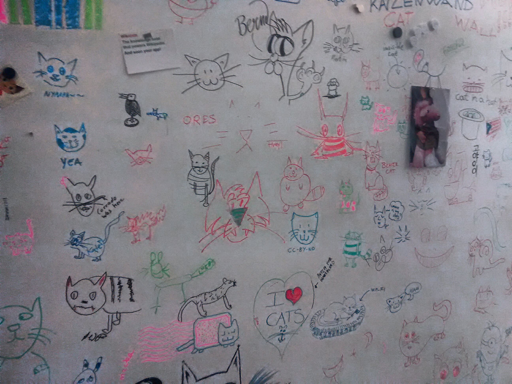
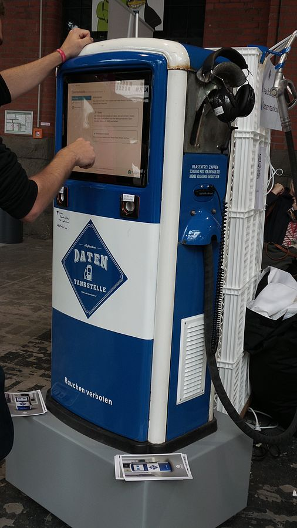

<figure class="floatCenter">
    
</figure>

*Cats, dinosaurs, data dispensers and other open sciency things that happened during spring equinox in Berlin. "Putting Open Science into practice" was the theme of this year's [Barcamp Open Science](https://www.open-science-conference.eu/barcamp/) at the Wikimedia Germany, which preceded the 4th annual [Open Science Conference](https://www.open-science-conference.eu/) hosted by the ZBW – Leibniz Information Centre for Economics and the Leibniz Research Alliance Science 2.0.*

## Open Science and the Youngest

During the traditional barcamp-esque round of introductions Michela Vignoli used [#YoungResearchers](https://twitter.com/search?q=%23YoungResearcher&src=tyah) as one of her three hastags of the day. I was reminded of the day when I found out that the usage of *"young"* and *"junior"* in academia strongly deviates from the common usage. While “young researcher” usually refers to a Postdoctoral Fellow, in fact, this fellow would often be quite advanced in terms of age, experience and degrees. While this isn't a problem per se, at one point I realised that many discussions in Open Science fail to address those, that are *younger than the young researchers*: Let's call them [#InfantResearchers](https://twitter.com/search?q=%23InfantResearcher&src=tyah) and [#UnbornScientists](https://twitter.com/search?q=%23UnbornScientiest&src=tyah).

<figure class="floatCenter">
    
    <figcaption>An infant researcher contemplating the future of science. By Kyle Flood from Victoria, British Columbia, Canada (Waaah!) <a href="http://creativecommons.org/licenses/by-sa/2.0)">CC BY-SA 2.0</a> via Wikimedia Commons</figcaption>
</figure>

Quite a few sessions at the BarCamp were either specifically dealing with questions concerning undergraduates & younger audiences, or discussing alternative ways of communicating and sharing science. 

+ [Open Science and the Youngest](https://etherpad.wikimedia.org/p/oscibar2017_session1)
+ [Infusing tradional classes on academic skills and information literacy with Open Science ideas](https://etherpad.wikimedia.org/p/oscibar2017_session18)
+ [Open Science through informal education (festivals etc.)](https://etherpad.wikimedia.org/p/oscibar2017_sesson14)

The topics that were discussed ranged from the faults of the current publishing system, over the "sweet spot" in the education of an undergraduate to introduce Open Science, to the sciency things that we'd like to organise on a festival.

I would like to share a few of my personal takeaway messagas of these sessions:

#### It's not always about publications

Let's try to **focus on #InfantResearchers** from time to time. Way too often discussions drift-off to the more "traditional" problems concerning people within academia such as wrong career incentives. The values and mindset of Openness should be taught independent of an academic career. The *culture change*, that was mentioned multiple times throughout the three days in Berlin, needs to take place in the society, not only within academia or our communities of OS/OA advocates. 

#### <strike>Open</strike> Science?

Multiple times I heard the statement that "Open Science" shouldn't have it's own name. **"Science" should be "Open Science"**. Without seriously trying to question the label of this endavour, I am wondering if using "Open Science" is appropriate to (1) reach out to people outside of academia and specifically undergraduate students, (2) convey the wide range of concepts that it entails?

I was so surprised, when I recently attended a mandatory session on *"Good Scientific Practise"* at the [Winter School Ethics and Neuroscience](http://www.mind-and-brain.de/events/detail/?tx_mbevents_pi1%5BbackPid%5D=39&tx_mbevents_pi1%5Bid%5D=456) in Berlin. What happened was that the parts of Open Science which are relevant to a student were covered, without using the quite broad and often ambiguous (and also politically loaded) term Open Science.

#### Great things are happening already

+ Maria Henkel (HHU Düsseldorf) described new approaches to grading students in CS classes. (e.g. accepting contributions to Open Source projects on GitHub)
+ Olga Gkotsopoulou (Free Software Foundation Europe) told us about educational projects in Greece utilising Wikipedia.[^1] Link drop: [Wikipedia Education Program](https://outreach.wikimedia.org/wiki/Education).

## The Open Science (Infrastructure) Landscape

Finally, I want to confess. Confess that I have lost track of all the infrastructure projects. Which ones are evil and which ones are good (or just semi-evil/good)? Which project was bought and incorporated by the other one (making it gold ultra-semi-evil-great...)? Which ones should I use to store my code/data and which are doomed to fail? Which tool to write collaboratively, which tool to communicate (with which team), which, which, which...

During the two days of the Open Science Conference lots of new projects were presented, and I am truly happy to see that so many people are trying their best to provide good research infrastructure. As a part of [Open Knowledge Maps](https://openknowledgemaps.org) I am actively contributing to the confusion, but nevertheless, I am often overwhelmed by the amount of alternatives for a seemingly simple task, which reminds me of this great xkcd comic:

<figure class="floatCenter">
    
    <figcaption>Standards. Source: <a href="https://xkcd.com/927/)">https://xkcd.com/927/</a></figcaption>
</figure>

I would be more than happy to read the student's guide to research infrastructure, which is both comprehensive and practical (huge lists/spreadsheets do not qualify). Maybe this has already been done (I'd be very grateful for a link), or maybe I am asking for an impossible feat (in which case I am happy to found an infrastructure self-help group).

------

All in all I spent three great days of meeting new and old friends, listening to some exciting (and some less) exciting talks and, most importantly, learning lots of useful things from, with and about the community.

## But what about cats, dinosaurs and data?!

Say no more...

<figure class="floatCenter">
    
    <figcaption>Conference dinner -- Dinos, food and port wine.</figcaption>
</figure>

<figure class="floatCenter">
    
    <figcaption>Cat wall @Wikimedia Berlin.</figcaption>
</figure>

<figure class="floatCenter">
    
    <figcaption>The Data Pump @Wikimedia Berlin. By <a href="//commons.wikimedia.org/w/index.php?title=User:Clic27&amp;action=edit&amp;redlink=1" class="new" title="User:Clic27 (page does not exist)">Clic27</a> - Own work, <a href="http://creativecommons.org/licenses/by-sa/3.0" title="Creative Commons Attribution-Share Alike 3.0">CC BY-SA 3.0</a>, <a href="https://commons.wikimedia.org/w/index.php?curid=32655489">Link</a></figcaption>
</figure>

[^1]: The projects were aiming for various populations such as teachers and adults ([CNN report in Greek](http://www.cnn.gr/focus/story/20047/otan-pigainame-mazi-sxoleio-me-tin-vikipaideia)), students in schools ([Wikipedia School](http://wikipedia-school.gr/)) and also universities ([blog post](https://blog.wikimedia.org/2013/06/06/wikipedia-education-thessaloniki/)).